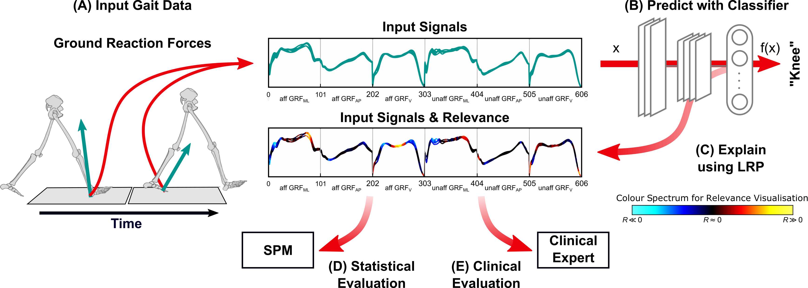

# Explaining Machine Learning Models for Clinical Gait Analysis



This repository contains the python code for training and evaluation of models as presented in
[Explaining Machine Learning Models for Clinical Gait Analysis](https://arxiv.org/abs/1912.07737)
```
@article{horst2019understanding,
  title={On the Understanding and Interpretation of Machine Learning Predictions in Clinical Gait Analysis Using Explainable Artificial Intelligence},
  author={Horst, Fabian and
          Slijepcevic, Djordje and
          Lapuschkin, Sebastian and
          Raberger, Anna-Maria and
          Zeppelzauer, Matthias and
          Samek, Wojciech and
          Breiteneder, Christian and
          Sch{\"o}llhorn, Wolfgang I
          and Horsak, Brian},
  journal={arXiv preprint arXiv:1912.07737},
  year={2019}
}
```

## Code, Data and Reproducibility

### Figures
Folder `figures` contains code and data for (generating) the overview figure shown in the paper.


### Model Training, Evaluation and XAI Attributions
Folder `python` contains code for model training and evaluation, based on python3 and the python sub-package of the [LRP Toolbox (version 1.3.0rc2)](https://github.com/sebastian-lapuschkin/lrp_toolbox). Should you use or extend the implementation in the present repository, please consider citing the toolbox, as well as our paper mentioned above.
```
@article{lapuschkin2016toolbox,
    author  = {Lapuschkin, Sebastian and
               Binder, Alexander and
               Montavon, Gr{\'e}goire and
               M\"uller, Klaus-Robert and
               Samek, Wojciech},
    title   = {The LRP Toolbox for Artificial Neural Networks},
    journal = {Journal of Machine Learning Research},
    year    = {2016},
    volume  = {17},
    number  = {114},
    pages   = {1-5},
    url     = {http://jmlr.org/papers/v17/15-618.html}
}
```

In folder `python`, the file `install.sh` contains instructions to setup [`Miniconda3`](https://docs.conda.io/en/latest/miniconda.html)-based virtual environments for python, as required by our code.
Option A only considers CPU hardware, while option B enables GPU support
for neural network training and evaluation. Comment/uncomment the lines appropriately.

All recorded gait data used in the paper is available in folder `python/data`.
Training- and evaluation scripts for fully reproducing the data splits, models and prediction explanations are
provided with files `python/gait_experiments_batch*.py`.
The folder `sge` contains files `*.args`, presenting the mentioned training-evaluation runs as (probably more) handy command line parameters, one per line, either to be called directly as
```
python gait_experiments.py ${ARGS_LINE}
```
or to be submitted to a SUN Grid Engine with
```
python sge_job_simple.py your_file_of_choice.args
```
Some paths and variables need to be adjusted.

### Dataset-wide Analyses of XAI
The Meta-Analysis of relevance attributions using Spectral Relevance Analysis (SpRAy) are based on implementations from the [CoRelAy](https://github.com/virelay/corelay) framework.
Should you use or extend the implementation in the present repository, please consider citing the software paper, as well as our paper mentioned at the top of this page.
```
@article{anders2021software,
      author={Anders, Christopher J. and
              Neumann, David and
              Samek, Wojciech and
              Müller, Klaus-Robert and
              Lapuschkin, Sebastian},
      title={Software for Dataset-wide XAI: From Local Explanations to Global Insights with {Zennit}, {CoRelAy}, and {ViRelAy}},
      journal= {CoRR},
      volume = {abs/2106.13200},
      year={2021},
}
```

In folder `python`, the file `install_metaanalysis.sh` contains the requirements to use the [CoRelAy](https://github.com/virelay/corelay) package implementing SpRAy.

All data analyzed with SpRAy in our manuscript is provided in `python/data_metaanalysis`. Various analyses can be configured and executed using
```
python main_metaanalysis.py ${ARGS}
```
Provide `--help` as part of the `${ARGS}` for an overview of the parameterization options. Run (and adapt as documented) the file `run_metaanalysis.sh` to replicate our results from the manuscript.