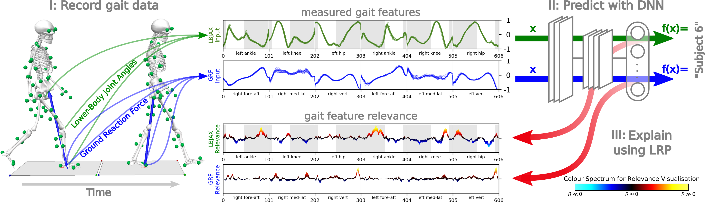

# Explaining the Unique Nature of Individual Gait Patterns with Deep Learning



This repository contains the python code for training and evaluation of models as presented in
[Explaining the unique nature of individual gait patterns with deep learning](https://doi.org/10.1038/s41598-019-38748-8)
```
TODO: add paper bibtex
```


Folder `figures` contains code and data for (generating) the figures shown in the paper.

Folder `python` contains code for model training and evaluation, based on python2, as a derivation of the python sub-package of the [LRP Toolbox (version 1.2.0)](https://github.com/sebastian-lapuschkin). Should you use or extend this implementation please consider citing the toolbox, as well as to our paper mentioned above.
```
@article{lapuschkin2016toolbox,
    author  = {Lapuschkin, Sebastian and Binder, Alexander and Montavon, Gr{\'e}goire and M\"uller, Klaus-Robert and Samek, Wojciech},
    title   = {The LRP Toolbox for Artificial Neural Networks},
    journal = {Journal of Machine Learning Research},
    year    = {2016},
    volume  = {17},
    number  = {114},
    pages   = {1-5},
    url     = {http://jmlr.org/papers/v17/15-618.html}
}
```

The recorded gait data used in the paper is available from [the Mendeley Data Repository](http://dx.doi.org/10.17632/svx74xcrjr.1), or in compact vector format in the file `python/Gait_GRF_JA_Label.mat`, which is part of this repository.
When using or refering to that data, please cite
```
@misc{horst2018public,
	author = {Horst, Fabian and Lapuschkin, Sebastian and Samek, Wojciech and M\"uller, Klaus-Robert and Sch\"ollhorn, Wolfgang I},
	title = {A public dataset of overground walking kinetics and full-body kinematics in healthy individuals},
	year = {2018},
	howpublished = {Mendeley Data Repository},
	note = {\url{http://dx.doi.org/10.17632/svx74xcrjr.1}}
}
```


Files describing the training, validation and test splits, the trained models on different feature sets (in part not discussed in the paper) and target labels (in part not discussed in the paper), as well as the model outputs, scores and analyses obtained via LRP and perturbation analysis can be obtained from the following locations, grouped by model type:

```
TODO: Link Linear baseline cases
TODO: Link 2-layer MLPs
TODO: Link 3-layer MLPs
TODO: Link CNNs
```
